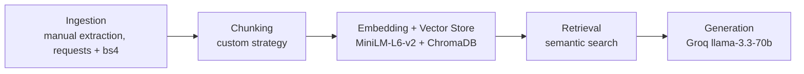

# Project 1 Planning: The Unofficial Guide

> Write this document before you write any pipeline code.
> Your spec and architecture diagram are what you'll use to direct AI tools (Claude, Copilot, etc.) to generate your implementation — the more specific they are, the more useful the generated code will be.
> Update the Retrieval Approach and Chunking Strategy sections if you change your approach during implementation.
> Update this file before starting any stretch features.

---

## Domain

<!-- What domain did you choose? Why is this knowledge valuable and hard to find through official channels? -->

UF campus dining experiences: student opinions and first-hand accounts about dining halls, the Reitz Union food court, meal plans, and eating on campus at the University of Florida. Students making decisions about meal plans, where to eat between classes, or how to handle dietary restrictions can't get honest answers from official sources - UF's own dining pages tell you what locations exist and what things cost, not what's actually good or worth avoiding. The real student consensus is scattered across Yelp, Reddit, Niche, Spoon University, and the Alligator, with no single place that pulls it together into something searchable and answerable.

---

## Documents

<!-- List your specific sources: URLs, subreddit names, forum threads, or file descriptions.
     Aim for at least 10 sources that together cover different subtopics or perspectives within your domain. -->

| #  | Source           | Description                   | URL or Location |
|----|------------------|-------------------------------|-----------------|
| 1  | Yelp             | Student reviews of Broward dining hall | `https://www.yelp.com/biz/fresh-food-company-broward-dining-gainesville` |
| 2  | Restaurantji     | Aggregated student reviews of Gator Corner | `https://www.restaurantji.com/fl/gainesville/gator-corner-dining-center-/` |
| 3  | Spoon University | Student-written review of Cravings Campus Kitchen (2023) | `https://spoonuniversity.com/school/ufl/reviewing-the-new-dining-hall/`           |
| 4  | The Alligator    | Student reactions to renovated Broward reopening (Aug 2024) | `https://www.alligator.org/article/2024/08/the-eatery-at-broward-hall-first-look`|
| 5  | The Alligator    | Student opinions on the tent dining hall during Broward closure (Jan 2024) | `https://www.alligator.org/article/2024/01/broward-tent` |
| 6  | The Alligator    | Students on vegan and dietary restriction options on campus (Jan 2024) | `https://www.alligator.org/article/2024/01/uf-vegan-experience`       |
| 7  | The Alligator    | Student dissatisfaction with on-campus dining, off-campus alternatives (Sep 2024) | `https://www.alligator.org/article/2024/09/what-to-know-about-a-new-student-meal-plan-alternative` |
| 8  | Niche            | Aggregated student reviews covering campus dining | `https://www.niche.com/colleges/university-of-florida/campus-life/` |
| 9  | Wanderlog        | Student reviews of the Reitz Union food court | `https://wanderlog.com/place/details/11039454/reitz-union` |
| 10 | Reddit r/ufl     | Student thread on campus dining | `https://www.reddit.com/r/ufl/comments/1szl19w/new_uf_meal_plans_breakdown/` |
| 11 | Reddit r/ufl     | Student thread for food budgeting | `https://www.reddit.com/r/ufl/comments/q4af5g/how_much_money_do_you_spend_on_food/` |
| 12 | Reddit r/ufl     | Student thread  covering  late-night dining| `https://www.reddit.com/r/ufl/comments/jh2ikl/good_food_after_midnight/` |          
---

## Architecture

---

## Chunking Strategy

<!-- How will you split documents into chunks?
     State your chunk size (in tokens or characters), overlap size, and explain why those
     numbers fit the structure of your documents.
     A review-heavy corpus warrants different chunking than a long FAQ. -->

**Chunk size:** 400–500 characters (roughly 100–125 tokens)

**Overlap:** 50 characters. Small because review documents are opinion units with no cross-boundary dependencies; overlap mainly helps when splitting long Alligator article paragraphs

**Reasoning:** The corpus is dominated by individual review snippets where the meaningful unit is one person's complete verdict on one location. Splitting mid-review destroys the location+opinion pairing retrieval depends on. 400–500 chars preserves most reviews as whole chunks while staying well under all-MiniLM-L6-v2's 256-token ceiling. Overlap is intentionally small because review documents have no cross-boundary dependencies; it only helps when splitting longer Alligator article paragraphs. Split order: review/comment boundaries first, then paragraph breaks (Alligator, Spoon University), then character limit with overlap as a fallback for long prose (Reddit meal plan post).

---

## Retrieval Approach

<!-- Which embedding model are you using (e.g., all-MiniLM-L6-v2 via sentence-transformers)?
     How many chunks will you retrieve per query (top-k)?
     If you were deploying this for real users and cost wasn't a constraint, what tradeoffs
     would you weigh in choosing a different embedding model — context length, multilingual
     support, accuracy on domain-specific text, latency? -->

**Embedding model:**

**Top-k:**

**Production tradeoff reflection:**

---

## Evaluation Plan

<!-- List your 5 test questions with their expected correct answers.
     Questions should be specific enough that you can judge whether the system's response
     is right or wrong. "What are good dining halls?" is too vague.
     "What do students say about wait times at [dining hall name] during lunch?" is testable. -->

| # | Question | Expected answer |
|---|----------|-----------------|
| 1 | | |
| 2 | | |
| 3 | | |
| 4 | | |
| 5 | | |

---

## Anticipated Challenges

<!-- What could go wrong? Name at least two specific risks with reasoning.
     Consider: noisy or inconsistent documents, missing source attribution, off-topic
     retrieval, chunks that split key information across boundaries. -->

1.

2.

---

## Architecture

<!-- Draw a diagram of your pipeline showing the five stages:
     Document Ingestion → Chunking → Embedding + Vector Store → Retrieval → Generation
     Label each stage with the tool or library you're using.
     You can use ASCII art, a Mermaid diagram, or embed a sketch as an image.
     You'll use this diagram as context when prompting AI tools to implement each stage. -->

---

## AI Tool Plan

<!-- For each part of the pipeline below, describe:
     - Which AI tool you plan to use (Claude, Copilot, ChatGPT, etc.)
     - What you'll give it as input (which sections of this planning.md, which requirements)
     - What you expect it to produce
     - How you'll verify the output matches your spec

     "I'll use AI to help me code" is not a plan.
     "I'll give Claude my Chunking Strategy section and ask it to implement chunk_text()
     with my specified chunk size and overlap" is a plan. -->

**Milestone 3 — Ingestion and chunking:**

**Milestone 4 — Embedding and retrieval:**

**Milestone 5 — Generation and interface:**
