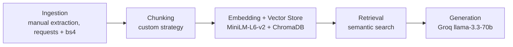

# Project 1 Planning: The Unofficial Guide

> Write this document before you write any pipeline code.
> Your spec and architecture diagram are what you'll use to direct AI tools (Claude, Copilot, etc.) to generate your implementation - the more specific they are, the more useful the generated code will be.
> Update the Retrieval Approach and Chunking Strategy sections if you change your approach during implementation.
> Update this file before starting any stretch features.

---

## Domain

<!-- What domain did you choose? Why is this knowledge valuable and hard to find through official channels? -->

UF campus dining experiences: student opinions and first-hand accounts about dining halls, the Reitz Union food court, meal plans, and eating on campus at the University of Florida. Students making decisions about meal plans, where to eat between classes, or how to handle dietary restrictions can't get honest answers from official sources - UF's own dining pages tell you what locations exist and what things cost, not what's actually good or worth avoiding. The real student consensus is scattered across Yelp, Reddit, Niche, Spoon University, and the Alligator, with no single place that pulls it together into something searchable and answerable.

---

## Documents

<!-- List your specific sources: URLs, subreddit names, forum threads, or file descriptions.
     Aim for at least 10 sources that together cover different subtopics or perspectives within your domain. -->

| #  | Source           | Description                   | URL or Location |
|----|------------------|-------------------------------|-----------------|
| 1  | Yelp             | Student reviews of Broward dining hall | `https://www.yelp.com/biz/fresh-food-company-broward-dining-gainesville` |
| 2  | Restaurantji     | Aggregated student reviews of Gator Corner | `https://www.restaurantji.com/fl/gainesville/gator-corner-dining-center-/` |
| 3  | Spoon University | Student-written review of Cravings Campus Kitchen (2023) | `https://spoonuniversity.com/school/ufl/reviewing-the-new-dining-hall/`           |
| 4  | The Alligator    | Student reactions to renovated Broward reopening (Aug 2024) | `https://www.alligator.org/article/2024/08/the-eatery-at-broward-hall-first-look`|
| 5  | The Alligator    | Student opinions on the tent dining hall during Broward closure (Jan 2024) | `https://www.alligator.org/article/2024/01/broward-tent` |
| 6  | The Alligator    | Students on vegan and dietary restriction options on campus (Jan 2024) | `https://www.alligator.org/article/2024/01/uf-vegan-experience`       |
| 7  | The Alligator    | Student dissatisfaction with on-campus dining, off-campus alternatives (Sep 2024) | `https://www.alligator.org/article/2024/09/what-to-know-about-a-new-student-meal-plan-alternative` |
| 8  | Niche            | Aggregated student reviews covering campus dining | `https://www.niche.com/colleges/university-of-florida/campus-life/` |
| 9  | Wanderlog        | Student reviews of the Reitz Union food court | `https://wanderlog.com/place/details/11039454/reitz-union` |
| 10 | Reddit r/ufl     | Student thread on campus dining | `https://www.reddit.com/r/ufl/comments/1szl19w/new_uf_meal_plans_breakdown/` |
| 11 | Reddit r/ufl     | Student thread for food budgeting | `https://www.reddit.com/r/ufl/comments/q4af5g/how_much_money_do_you_spend_on_food/` |
| 12 | Reddit r/ufl     | Student thread  covering  late-night dining| `https://www.reddit.com/r/ufl/comments/jh2ikl/good_food_after_midnight/` |          
---

## Architecture

---

## Chunking Strategy

<!-- How will you split documents into chunks?
     State your chunk size (in tokens or characters), overlap size, and explain why those
     numbers fit the structure of your documents.
     A review-heavy corpus warrants different chunking than a long FAQ. -->

**Chunk size:** 400–500 characters (roughly 100–125 tokens)

**Overlap:** 50 characters. Small because review documents are opinion units with no cross-boundary dependencies; overlap mainly helps when splitting long Alligator article paragraphs

**Reasoning:** The corpus is dominated by individual review snippets where the meaningful unit is one person's complete verdict on one location. Splitting mid-review destroys the location+opinion pairing retrieval depends on. 400–500 chars preserves most reviews as whole chunks while staying well under all-MiniLM-L6-v2's 256-token ceiling. Overlap is intentionally small because review documents have no cross-boundary dependencies; it only helps when splitting longer Alligator article paragraphs. Split order: review/comment boundaries first, then paragraph breaks (Alligator, Spoon University), then character limit with overlap as a fallback for long prose (Reddit meal plan post).

---

## Retrieval Approach

<!-- Which embedding model are you using (e.g., all-MiniLM-L6-v2 via sentence-transformers)?
     How many chunks will you retrieve per query (top-k)?
     If you were deploying this for real users and cost wasn't a constraint, what tradeoffs
     would you weigh in choosing a different embedding model - context length, multilingual
     support, accuracy on domain-specific text, latency? -->

**Embedding model:** `all-MiniLM-L6-v2` via `sentence-transformers`. Runs locally with no API key and no rate limits. Produces 384-dimensional vectors and has a 256-token input limit (~1000 characters), which fits comfortably within our 500-character chunk ceiling.

**Top-k:** 5. At k=4 the risk is that the one chunk containing the specific fact a user needs is missed entirely. At k=5 there is still enough signal for the LLM to produce a grounded answer without excessive noise from loosely related chunks. Will tune down to 4 if generation responses become too diluted.

**Production tradeoff reflection:** For a production system the main tradeoffs are context length, accuracy, and hosting cost. `all-MiniLM-L6-v2` caps at 256 tokens, which is fine for short reviews but would truncate longer documents. OpenAI's `text-embedding-3-small` supports 8k tokens and tends to score higher on semantic benchmarks, but adds per-call API cost, latency, and a hard dependency on an external service. `multilingual-e5-large` would handle non-English reviews (some Yelp reviews in this corpus are in Chinese) but is significantly larger and slower to run locally. For this project the local, zero-cost model is the right tradeoff; in production I would switch to an API-hosted model with longer context for better recall on multi-sentence queries.

---

## Evaluation Plan

<!-- List your 5 test questions with their expected correct answers.
     Questions should be specific enough that you can judge whether the system's response
     is right or wrong. "What are good dining halls?" is too vague.
     "What do students say about wait times at [dining hall name] during lunch?" is testable. -->

| # | Question | Expected answer |
|---|----------|-----------------|
| 1 | What do students say about food quality at Gator Corner compared to Broward? | Gator Corner is generally rated higher. Multiple Restaurantji reviews say it is decent and consistent; one student directly states "Gator Corner is 100 times better than Broward Dining." Post-renovation (Aug 2024), another student says he now prefers The Eatery at Broward over Gator Corner. |
| 2 | Are there vegan options at UF dining halls, and how do students rate them? | All dining halls offer vegan options, but students find them limited. Cravings Campus Kitchen has no vegan dessert. The Alligator (Jan 2024) quotes a freshman saying options are "frequently limited to meager portions." Gator Corner has a dedicated vegan/allergen section. Staff said they are actively adding more plant-based dishes. |
| 3 | How much does a UF meal plan cost and is it worth buying? | Residential plans range from $1,120 (Upperclassman 125) to $3,150 (Super Gator) per semester. Multiple Reddit r/ufl users advise against buying a plan: "I highly recommend no one ever get a meal plan… you will end up losing money in the long run. Just pay as you go." |
| 4 | What food options are available at the Reitz Union? | Panda Express, Starbucks, Halal Shack, Baba's Pizza, Subway, and Mi Apa are mentioned by Wanderlog reviewers. Outdoor seating overlooks a pond; free student printing also available. One reviewer calls Mi Apa and Panda Express their favorites. |
| 5 | Where can UF students find food after midnight? | Reddit r/ufl thread lists: Taco Bell on Archer (~3 am), Checkers on University Ave (until 5 am), McDonald's on Archer (24/7, breakfast at 4 am), Gumby's Pizza (~3 am), Wawa (always open), and Flaco's Tacos downtown (open late most nights). |

---

## Anticipated Challenges

<!-- What could go wrong? Name at least two specific risks with reasoning.
     Consider: noisy or inconsistent documents, missing source attribution, off-topic
     retrieval, chunks that split key information across boundaries. -->

1. **Outdated reviews mixed with current ones.** Broward underwent a full renovation and reopened as "The Eatery @ Broward Hall" in August 2024. Reviews in this corpus span 2011–2025, so pre-renovation complaints (raw chicken, recycled leftovers, dirty utensils) will be retrieved at equal weight alongside post-renovation praise. The embedding model has no date awareness, meaning a query like "is Broward worth going to?" could surface a 2017 one-star rant as the top result even though that dining hall no longer exists in its old form.

2. **Off-topic retrieval on vague queries.** The food-budgeting Reddit thread (doc 11) and the late-night thread (doc 12) discuss grocery shopping, cooking at home, and restaurants several miles from campus. A query like "how do I eat cheaply at UF?" may retrieve chunks about Trader Joe's or Sam's Club rather than on-campus dining, because the embedding similarity between "eating cheaply at UF" and a comment about $200/month grocery budgets is high even though the chunk does not answer the question in the intended domain.

---

## AI Tool Plan

<!-- For each part of the pipeline below, describe:
     - Which AI tool you plan to use (Claude, Copilot, ChatGPT, etc.)
     - What you'll give it as input (which sections of this planning.md, which requirements)
     - What you expect it to produce
     - How you'll verify the output matches your spec

     "I'll use AI to help me code" is not a plan.
     "I'll give Claude my Chunking Strategy section and ask it to implement chunk_text()
     with my specified chunk size and overlap" is a plan. -->

**Milestone 3 - Ingestion and chunking:**
I gave Claude the Documents section and Chunking Strategy section from this file plus sample raw `.txt` files from each source type (Yelp, Alligator, Reddit). I asked it to implement `ingest.py` (per-source noise filtering and unit extraction) and `chunk.py` (sentence-boundary splitting at 400–500 chars with 50-char overlap). I verified the output by running `chunk.py` and confirming: 332 chunks, max 500 chars, avg 224 chars, no empty strings, and that metadata (source/location/url) is attached to every chunk.

**Milestone 4 - Embedding and retrieval:**
I gave Claude the Retrieval Approach section from this file, the pipeline architecture diagram, and the chunk dict schema produced by `chunk_units()` (`text`, `source`, `location`, `url`, `doc_type`, `filename`). I asked it to implement `embed.py` with two functions: `build_index()` (embed all 332 chunks with `all-MiniLM-L6-v2` and persist them in a ChromaDB collection with cosine similarity) and `retrieve(query, k=5)` (embed the query and return the top-k chunks with distance scores). Claude produced the full file including batched inserts, a skip-rebuild guard, and a `__main__` smoke test covering all 5 evaluation queries. I directed it to add two metadata fields not in the original spec - `chunk_index` and `chunk_total` - to satisfy the requirement that each chunk records its position within its source document. I verified by running `embed.py` and confirming 332 chunks indexed, all 5 test queries returned on-topic results with cosine distances below 0.5, and filenames in every metadata dict.

**Milestone 5 - Generation and interface:**
I gave Claude the Milestone 5 requirements (grounded generation, source attribution, Gradio interface), the `retrieve()` function signature from `embed.py`, and the constraint that grounding must be enforced structurally - not just suggested in a prompt. Claude produced `generate.py` with a two-layer grounding design: a distance threshold that drops irrelevant chunks before the LLM is called, and a strict system prompt that forbids the model from using training knowledge or referencing passage structure. It also produced `app.py` as a Gradio Blocks interface with an answer card, a sources table, and five example questions. I made three overrides after testing: (1) removed the `[1]`, `[2]`, `[3]` numbering from the context format because the model was citing passage numbers in its answers; (2) extended the system prompt to explicitly ban phrases like "one reviewer", "the individual", and "another perspective" after the model continued referencing passage positions by description; (3) directed Claude to append source filenames (e.g. `4_alligator_broward_renovated.txt`) to the answer card programmatically from chunk metadata, rather than relying on the LLM to cite them.
